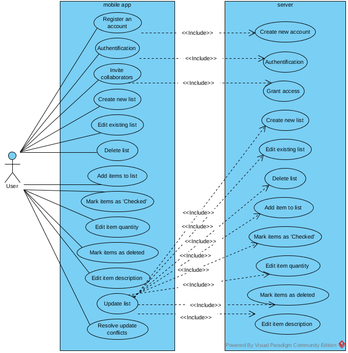
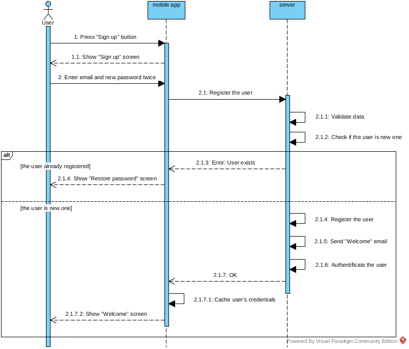
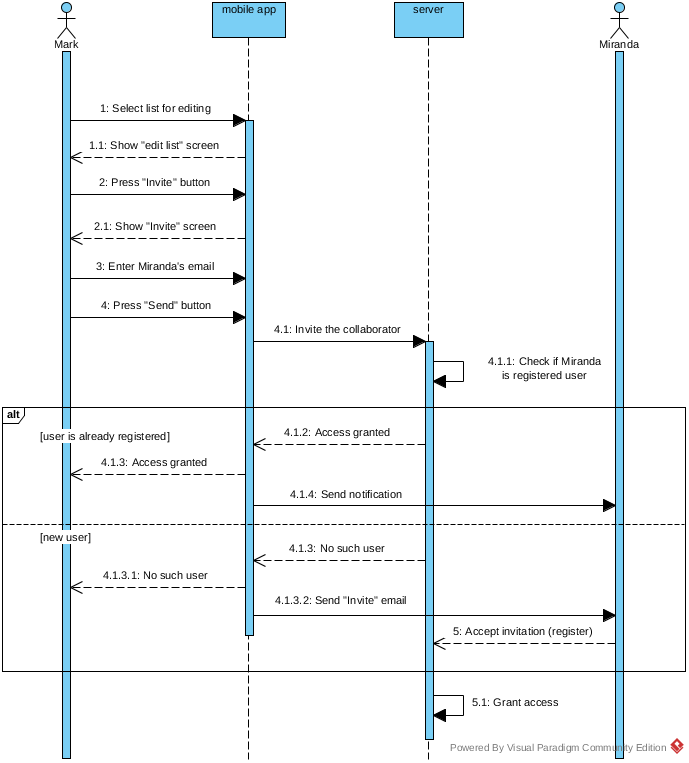
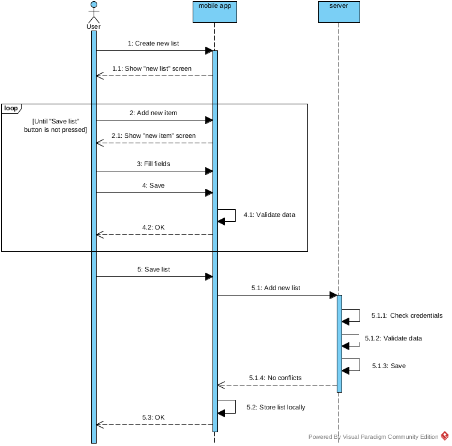
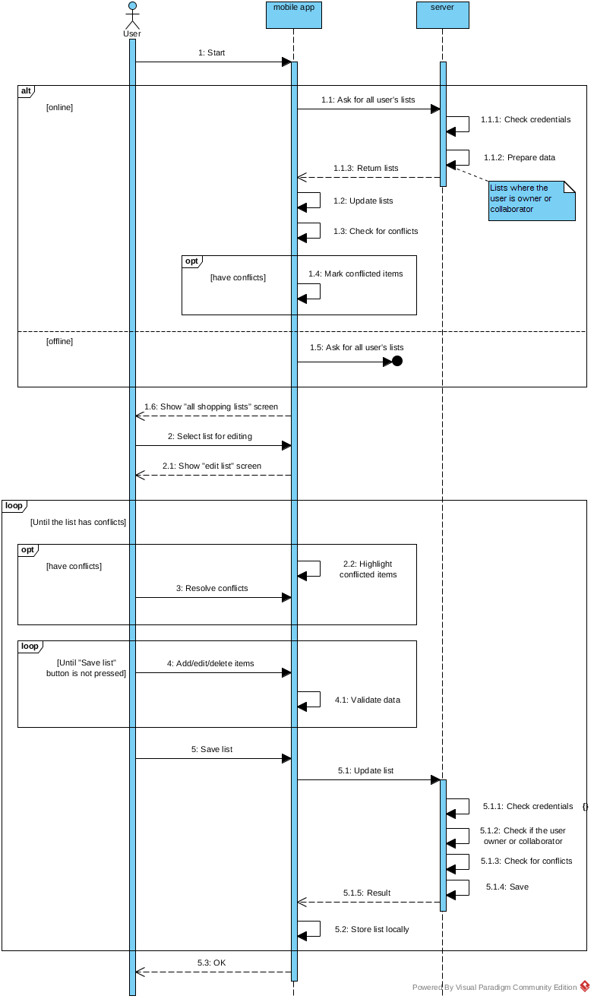

= Shopping list backend

== Introduction

This document describes a system which allows users to manage shopping lists on their mobile phone. The system has the two main parts - the mobile application (frontend) and server (backend). According to the link:doc/task.adoc[code challenge task] this project implements only server-backend.

== Prerequisites

To compile and run this project you need any operating system with bash interpreter or Windows 2000 or newest. Also you need Oracle JDK or OpenJDK version 8.

== How to build

In the project folder type the following command:

_Windows:_
[source]
----
shopping-list> mvnw.cmd clean install
----

_Linux / MacOS:_
[source]
----
$ ./mvnv clean install
----

== How to run

In the project folder type the following command:

For all operating systems:
[source]
----
java -jar ./target/shopping-list*.jar
----

== System design description

=== Use cases

The backend solution enables mobile app to synchronize lists and its items across devices and accounts. The system can be in use cases shown on the diagram:

=== User registration

The process of user registration is shown on the following diagram:

=== Invite a friend

The friend invitation process is shown on this diagram:

=== Add new shopping list

Look at the next diagram to see how the adding new list process is happening:

=== Edit existing shopping lists

The next diagram shows how users edit shopping lists and how the system helps to resolve conflicts:

== Implementation

=== Tools

This project written in Java 8 and uses and the following tools:

* *Spring Boot* - provides the ability to create uber-jar, all-in-one file
* *Spring Data JPA* - a convenient way to operate data
* *Hibernate* - the ORM engine
* *Spring security* - to protect private user date from unauthorized access
* *Jersey* - JAX-RS implementation for creating RESTful services
* *H2* - SQL-compatible in-memory database
* *HikariCP* - a connection pool for optimal database connections using
* *Junit* - testing framework
* *Lombok* - a library to reduce boilerplate code
* *Maven* - a compile tool

=== Project structure

The project contains following packages:

* *entities* - contains entities that are serialized to json structures
* *exceptions* - contains specific exceptions
* *repository* - contains interfaces to manage data in  database
* *rest* - contains `/lists` and `/users` (not implemented in current version) endpoint with data-classes and jersey config
* *security* - security config classes
* *services* - contains the application main logic to process users (not implemented in current version), shopping lists, and list items.

The file *application.properties* contains app settings.

The *test* folder contains tests for all implemented in the main code use cases.

*data.sql* contains test data imported into database on tests start.

=== Network interface

The backend solution built as RESTful web-service and has the following endpoints:

* */users* - used for manage users (not implemented in current version)
* */lists* - used for manage shopping lists
** `GET /lists` - returns all lists with items for an authorized user and `200 "ok"` response code.
** `GET /list/{id}` - returns specific list with items by given id. Returns `200 "ok"` response code in case of success or `404 not found` if the list doesn't exist or doesn't belong to the authorized user.
** `POST /list`- stores a new list with items. Returns `200 "ok"` response code and URL to the new list in case of success. If the list is not correct, returns `400 "bad request"` response code. Doesn't return a body.
** `POST /list/{id}` - replaces an existing list with given id by modified one. Returns response code `200 "ok"` if no errors or `400 "bad request"` if incoming data is not correct. Returns `404 not found` if the list doesn't exist or doesn't belong to the authorized user. In the body returns information about conflicts if they were happening.
** `DELETE /list/{id}` - removes a shopping list with given id from the database. Returns `200 "ok"` if success or `404 not found` if the list doesn't exist or doesn't belong to the authorized user. Response has no body.

==== Commands to the server

===== Get all user's shopping lists

_Method:_ `GET`

_URI:_ `/lists/`

_Request body:_ <ignored>

_Response body example:_
[source,json]
----
[
  {
    "id": 1,
    "name": "CPUs",
    "description": "Processors for servers #1, #6, #11",
    "owner": {
      "id": 1,
      "login": "mark.johnson@yahoo.com",
      "name": "Mark Johnson"
    },
    "listItems": [
      {
        "id": 1,
        "version": 0,
        "name": "Core i5",
        "description": "CPU Intel Core i5",
        "checked": true,
        "quantity": 2,
        "isDeleted": false,
        "author": {
          "id": 1,
          "login": "mark.johnson@yahoo.com",
          "name": "Mark Johnson"
        },
        "device": {
          "id": 1,
          "name": "Samsung Galaxy S8"
        }
      },
      {
        "id": 2,
        "version": 0,
        "name": "Core i7",
        "description": "CPU Intel Core i7",
        "checked": true,
        "quantity": 1,
        "isDeleted": false,
        "author": {
          "id": 1,
          "login": "mark.johnson@yahoo.com",
          "name": "Mark Johnson"
        },
        "device": {
          "id": 1,
          "name": "Samsung Galaxy S8"
        }
      }
    ]
  },
  {
    "id": 5,
    "name": "RAMs",
    "description": "Memory for servers",
    "owner": {
      "id": 1,
      "login": "mark.johnson@yahoo.com",
      "name": "Mark Johnson"
    },
    "listItems": []
  }
]
----

===== Get specific shopping list

_Method:_ `GET`

_URI example:_ `/lists/1`

_Basic authorization:_ Required

_Request body:_ <ignored>

_Response body example:_
[source,json]
----
{
  "id": 1,
  "name": "CPUs",
  "description": "Processors for servers #1, #6, #11",
  "owner": {
    "id": 1,
    "login": "mark.johnson@yahoo.com",
    "name": "Mark Johnson"
  },
  "listItems": [
    {
      "id": 1,
      "version": 0,
      "name": "Core i5",
      "description": "CPU Intel Core i5",
      "checked": true,
      "quantity": 2,
      "isDeleted": false,
      "author": {
        "id": 1,
        "login": "mark.johnson@yahoo.com",
        "name": "Mark Johnson"
      },
      "device": {
        "id": 1,
        "name": "Samsung Galaxy S8"
      }
    },
    {
      "id": 2,
      "version": 0,
      "name": "Core i7",
      "description": "CPU Intel Core i7",
      "checked": true,
      "quantity": 1,
      "author": {
        "id": 1,
        "login": "mark.johnson@yahoo.com",
        "name": "Mark Johnson"
      },
      "device": {
        "id": 1,
        "name": "Samsung Galaxy S8"
      }
    }
  ]
}
----

===== Store new shopping list

_Method:_ `POST`

_URI:_ `/lists/`

_Basic authorization:_ Required

_Request body example:_
[source,json]
----
{
  "name": "CPUs",
  "description": "Processors for servers #1, #6, #11",
  "author": {
    "id": 1,
    "login": "mark.johnson@yahoo.com",
    "name": "Mark Johnson"
  },
  "device": {
    "id": 1,
    "name": "Samsung Galaxy S8"
  },
  "listItems": [
    {
      "version": 0,
      "name": "Core i5",
      "description": "CPU Intel Core i5",
      "checked": true,
      "quantity": 2
    },
    {
      "version": 0,
      "name": "Core i7",
      "description": "CPU Intel Core i7",
      "checked": true,
      "quantity": 1
    }
  ]
}
----

_Response body:_ <empty>

===== Update existing shopping list

_Method:_ `POST`

_URI example:_ `/lists/1`

_Basic authorization:_ Required

_Request body example (no info about conflicts):_
[source,json]
----
{
  "id": 1,
  "name": "CPUs",
  "description": "Processors for servers #1, #6, #11",
  "author": {
    "id": 1,
    "login": "mark.johnson@yahoo.com",
    "name": "Mark Johnson"
  },
  "device": {
    "id": 1,
    "name": "Samsung Galaxy S8"
  },
  "listItems": [
    {
      "id": 1,
      "version": 0,
      "name": "Core i5",
      "description": "CPU Intel Core i5",
      "checked": true,
      "quantity": 2
    },
    {
      "id": 2,
      "version": 1,
      "isDeleted": true
    }
  ]
}
----

_Response body (no conflicts):_
[source,json]
----
{
  "conflictedItems": [],
  "newRemoteItems": []
}
----

_Response body (has 1 conflict):_
[source,json]
----
{
  "conflictedItems": [
    {
      "id": 1,
      "version": 2,
      "name": "AMD",
      "description": "CPU AMD",
      "checked": true,
      "quantity": 1,
      "author": {
        "id": 2,
        "login": "miranda.johnson@yahoo.com",
        "name": "Miranda Johnson"
      },
      "device": {
        "id": 3,
        "name": "Apple iPhone"
      },
    }
  ],
  "newRemoteItems": []
}
----

_Response body (has 1 new remote item):_
[source,json]
----
{
  "conflictedItems": [],
  "newRemoteItems": [
    {
      "id": 10,
      "version": 1,
      "name": "Ciryx",
      "description": "Antique Cityx CPU",
      "checked": false,
      "quantity": 5,
      "author": {
        "id": 2,
        "login": "miranda.johnson@yahoo.com",
        "name": "Miranda Johnson"
      },
      "device": {
        "id": 3,
        "name": "Apple iPhone"
      },
    }
  ]
}
----

_Request body example (with fixed conflicted items):_
[source,json]
----
{
  "id": 1,
  "name": "CPUs",
  "description": "Processors for servers #1, #6, #11",
  "author": {
    "id": 1,
    "login": "mark.johnson@yahoo.com",
    "name": "Mark Johnson"
  },
  "device": {
    "id": 1,
    "name": "Samsung Galaxy S8"
  },
  "listItems": [
    {
      "id": 1,
      "version": 0,
      "name": "Core i5",
      "description": "CPU Intel Core i5",
      "checked": true,
      "quantity": 2,
      "force": true
    },
    {
      "id": 2,
      "version": 1,
      "isDeleted": true,
      "force": true
    },
    {
      "id": 10,
      "version": 1,
      "name": "Ciryx",
      "description": "Antique Cityx CPU",
      "checked": false,
      "quantity": 5,
      "force": true
    }
  ]
}
----

_Response body:_ no conflicts.

=== Limitations

In the current version the following functions are implemented particularly:

* working with shopping list collaborators - supported authorship of editings, conflict resolving with providing info about editors, owners mangement; not supported storing collaborators in the database.
* security - no integration with an external user log in system. Basic authorization with no user roles is used.

[.right]
=== ©

vadims.public.box@gmail.com +
